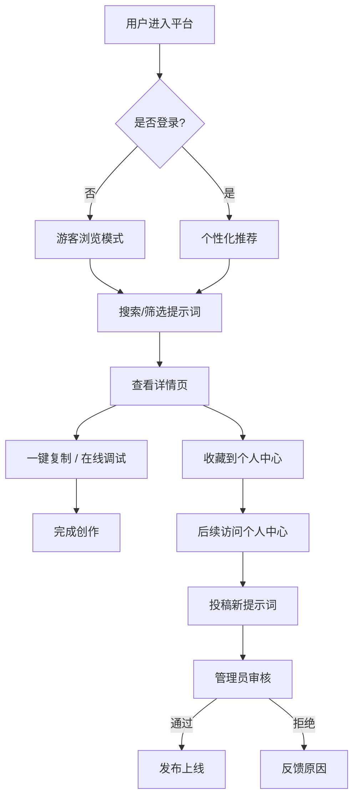
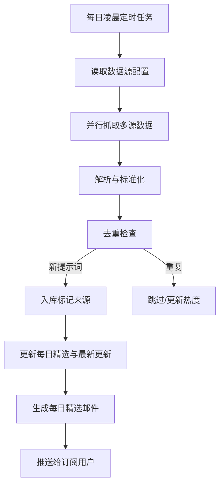

# PromptHub - AI 提示词聚合平台 PRD

## 1. 产品概述

PromptHub 是一个汇聚生图、生视频、任务执行类优质 AI 提示词的全栈聚合平台，每日自动从公开社区、社交媒体、AI 模型官方文档抓取并更新，同时支持用户投稿与社区共建。

- **解决的问题**：AI 创作者在生图/生视频/任务执行时难以快速找到优质、最新、可复用的提示词，且优质提示词分散在多个平台。
- **目标用户**：AI 创作者、设计师、视频创作者、Prompt 工程师、开发者。
- **核心价值**：一站式提示词发现、调试、收藏与订阅平台，每日更新保证新鲜度，社区投稿保证覆盖面。

## 2. 核心功能

### 2.1 用户角色

| 角色 | 注册方式 | 核心权限 |
|------|---------|---------|
| 游客 | 无需注册 | 浏览、搜索、筛选、复制公开提示词、查看效果对比 |
| 注册用户 | 邮箱 / GitHub / Google OAuth | 含游客权限 + 收藏、评分、投稿、订阅每日精选、个人中心 |
| 管理员 | 后台指定 | 含用户权限 + 投稿审核、提示词管理、数据源配置、定时任务监控、数据看板 |

### 2.2 功能模块

1. **首页**：Hero 区、每日精选、分类导航（生图/生视频/任务执行）、最新更新、热门趋势、订阅入口
2. **探索页**：提示词卡片瀑布流、多维筛选侧栏、全文搜索、排序、分页
3. **提示词详情页**：内容展示、参数标签、效果对比图、一键复制、在线调试、评分、相关推荐、评论
4. **个人中心**：收藏夹管理、我的投稿、订阅管理、个人偏好设置
5. **投稿页**：提交提示词表单（类型、模型、标签、参数、效果示例）
6. **管理后台**：投稿审核队列、提示词 CRUD、数据源管理、定时任务监控、数据看板

### 2.3 页面详情

| 页面名称 | 模块名称 | 功能描述 |
|---------|---------|---------|
| 首页 | Hero 区 | 标语 + 实时搜索框 + 每日更新计数动画 |
| 首页 | 每日精选 | 横向卡片轮播，展示当日编辑精选提示词 |
| 首页 | 分类导航 | 生图 / 生视频 / 任务执行三大入口卡片 |
| 首页 | 最新更新 | 按更新时间倒序的提示词列表预览 |
| 首页 | 热门趋势 | 按浏览/复制量排序的热门提示词 |
| 首页 | 订阅入口 | 邮箱订阅每日精选邮件 |
| 探索页 | 顶栏搜索 | 全文搜索 + 模型/类型快速切换 |
| 探索页 | 筛选侧栏 | 类型、模型、标签、语言、时间、热度多级筛选 |
| 探索页 | 卡片瀑布流 | 提示词卡片含预览图、标题、标签、复制按钮、收藏按钮 |
| 探索页 | 排序栏 | 最新 / 最热 / 评分 / 随机 |
| 详情页 | 内容展示 | 提示词全文（代码块样式）、模型参数、生成时间 |
| 详情页 | 效果对比 | 多张生成结果图轮播 / 网格对比 |
| 详情页 | 一键复制 | 复制提示词到剪贴板，带 toast 反馈 |
| 详情页 | 在线调试 | 调用对应 AI 模型 API 实时预览（需配置 API Key） |
| 详情页 | 评分与评论 | 五星评分 + 评论列表 |
| 详情页 | 相关推荐 | 同标签/同模型的提示词推荐 |
| 个人中心 | 收藏夹 | 分组管理收藏的提示词 |
| 个人中心 | 我的投稿 | 投稿列表 + 状态（待审/通过/拒绝） |
| 个人中心 | 订阅管理 | 订阅频率、分类偏好、退订 |
| 投稿页 | 投稿表单 | 类型、模型、提示词内容、参数、标签、效果示例图上传 |
| 管理后台 | 审核队列 | 投稿列表 + 批量审核通过/拒绝 |
| 管理后台 | 提示词管理 | 提示词 CRUD、批量操作、标签管理 |
| 管理后台 | 数据源管理 | 配置各数据源抓取规则、频率、启用状态 |
| 管理后台 | 定时任务监控 | 每日抓取任务运行状态、日志、手动触发 |
| 管理后台 | 数据看板 | 提示词总量、新增趋势、热门分类、用户活跃度 |

## 3. 核心流程

### 3.1 浏览搜索流程
用户进入首页 → 通过搜索或分类导航进入探索页 → 使用侧栏筛选缩小范围 → 点击卡片进入详情页 → 一键复制或在线调试 → 收藏到个人中心。

### 3.2 投稿审核流程
注册用户填写投稿表单 → 提交后状态为"待审" → 管理员在审核队列查看 → 通过则发布上线，拒绝则反馈原因 → 用户在个人中心查看审核结果。

### 3.3 每日自动更新流程
定时任务（每日凌晨）触发 → 按数据源配置依次抓取 → 解析去重 → 入库标记来源 → 更新首页"每日精选"与"最新更新" → 推送订阅邮件。

### 3.4 在线调试流程
用户在详情页点击"在线调试" → 弹窗输入 API Key（本地存储）→ 选择参数 → 调用对应 AI 模型 → 展示生成结果 → 可保存到收藏夹。

## 4. 用户界面设计

### 4.1 设计风格

**整体定位**：暗色科技感，未来感与专业感并存，契合 AI 工具属性。

- **主色**：深邃近黑背景 `#0A0A0F`，卡片层 `#13131A`，悬浮层 `#1C1C26`
- **强调色**：霓虹紫 `#7C5CFF`（主操作）+ 电光青 `#00E5FF`（强调/链接）+ 玫红 `#FF3D71`（警示/热度）
- **文字色**：主文字 `#E8E8F0`，次要文字 `#8B8BA0`，禁用 `#4A4A5C`
- **渐变**：紫色到青色的对角渐变用于 Hero、按钮高光、卡片边框光效
- **按钮风格**：圆角矩形（8-12px），主按钮带霓虹辉光阴影，悬停时光晕扩散
- **字体**：展示字体 Bricolage Grotesque（英文/数字标题），正文 Noto Sans SC（中文友好），等宽 JetBrains Mono（提示词代码展示）
- **布局**：卡片化网格 + 玻璃拟态层 + 细网格背景纹理，顶部固定导航
- **图标**：线性图标（Lucide 风格），细描边 1.5px，霓虹色高亮
- **氛围细节**：背景噪点纹理、霓虹光晕、扫描线效果、网格底纹

### 4.2 页面设计概览

| 页面名称 | 模块名称 | UI 元素 |
|---------|---------|---------|
| 首页 | Hero 区 | 全屏渐变背景 + 噪点 + 居中大标题 + 实时搜索框 + 浮动粒子 |
| 首页 | 每日精选 | 横向滚动卡片，霓虹边框光效，悬停上浮 |
| 首页 | 分类导航 | 三大入口卡片，图标 + 渐变背景，悬停光晕 |
| 首页 | 最新/热门 | 网格卡片瀑布流，每卡片含预览图 + 标签 |
| 探索页 | 顶栏 | 固定搜索栏 + 模型切换 Tab + 排序下拉 |
| 探索页 | 筛选侧栏 | 左侧固定栏，折叠式分组，复选框 + 滑块 |
| 探索页 | 卡片流 | 响应式网格，卡片含预览图、标题、复制/收藏按钮 |
| 详情页 | 顶部 | 面包屑 + 标题 + 来源标签 + 浏览/复制计数 |
| 详情页 | 提示词区 | 等宽字体代码块 + 一键复制按钮 + 参数标签 |
| 详情页 | 效果对比 | 多图网格 + 点击放大灯箱 |
| 详情页 | 调试弹窗 | 居中模态框 + 参数表单 + 结果预览区 |
| 个人中心 | 侧栏导航 | 左侧固定导航 + 头像 + 菜单项 |
| 投稿页 | 表单 | 分步表单 + 实时预览 + 标签输入器 |
| 管理后台 | 数据看板 | 顶部统计卡片 + 图表 + 表格列表 |

### 4.3 响应式设计

- **桌面优先**：1440px 基准设计，最大宽度 1280px 居中
- **平板适配**：768-1024px 时筛选侧栏改为顶部折叠，卡片由 4 列变 2 列
- **移动端**：< 768px 时单列布局，顶部导航折叠为汉堡菜单，搜索框全宽
- **触摸优化**：按钮最小点击区域 44px，卡片间距增大，禁用悬停效果改用点击反馈

### 4.4 动效设计

- **页面加载**：Hero 区标题逐字浮现 + 背景粒子淡入，staggered reveal
- **卡片悬停**：上浮 4px + 霓虹边框光晕扩散
- **复制反馈**：toast 从底部滑入 + 复制图标变勾选动画
- **筛选切换**：卡片淡出淡入过渡
- **滚动触发**：滚动到可视区时卡片逐个上浮显现
- **数字动画**：统计数据滚动增长动画
