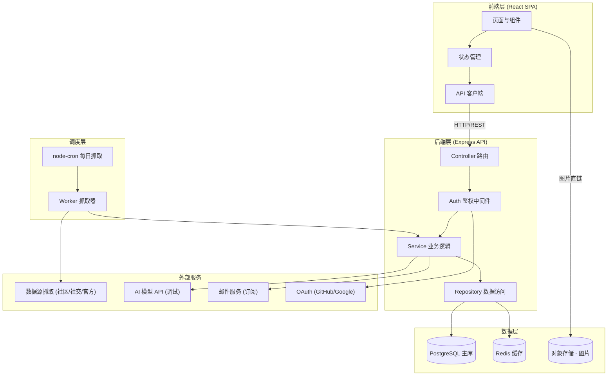
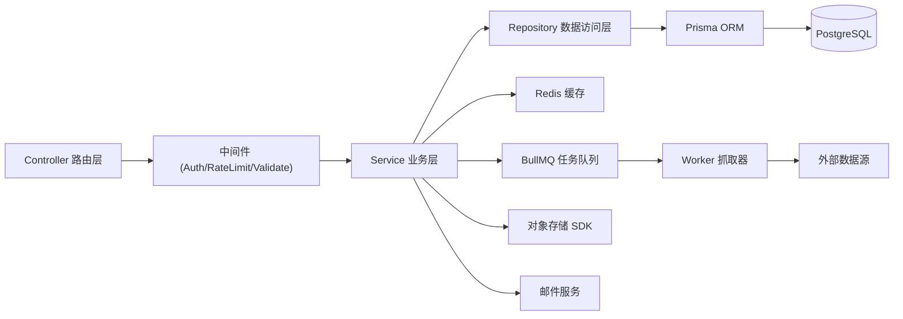
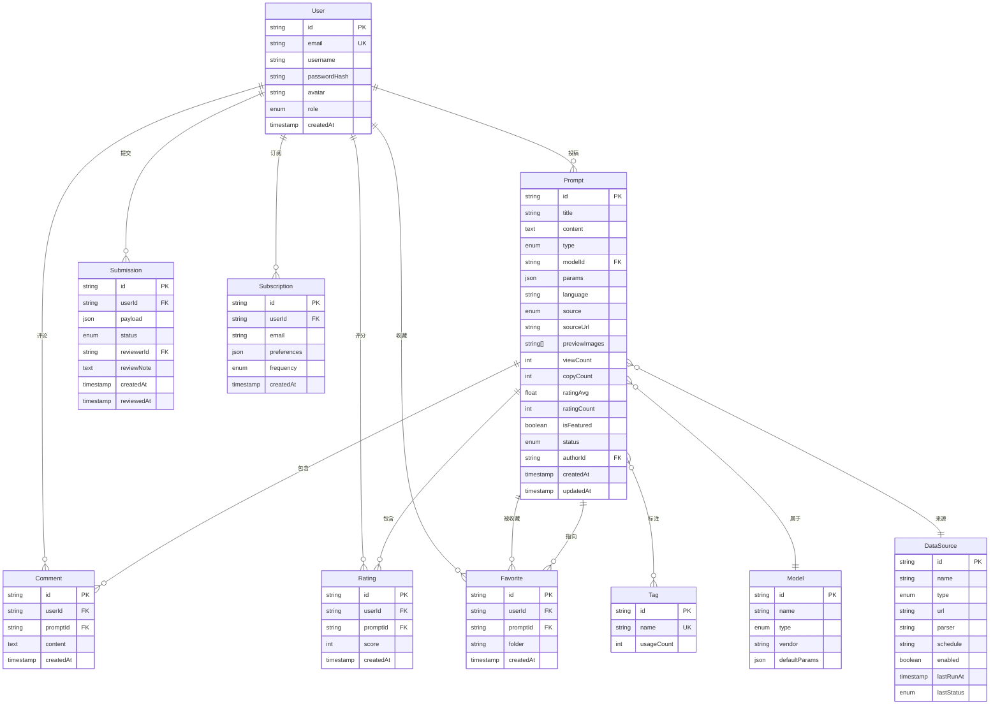

# PromptHub - 技术架构文档

## 1. 架构设计

整体采用前后端分离的全栈架构，前端 React SPA + 后端 Node.js/Express REST API + PostgreSQL 数据库 + 定时抓取服务，外部依赖对象存储（图片）与邮件服务。



## 2. 技术选型

- **前端**：React 18 + React Router 6 + TypeScript + Tailwind CSS 3 + Vite
- **状态管理**：Zustand（轻量）+ React Query（服务端状态）
- **UI 库**：Radix UI 原语 + 自定义样式（Tailwind），Lucide 图标，Motion（动效）
- **后端**：Node.js + Express 4 + TypeScript
- **数据库**：PostgreSQL 15（主存储）+ Redis 7（缓存、限流、队列）
- **ORM**：Prisma（类型安全、迁移管理）
- **鉴权**：JWT（Access + Refresh）+ OAuth 2.0（GitHub、Google）通过 Passport
- **全文搜索**：PostgreSQL 全文检索（pg_trgm + tsvector）+ 可选 Meilisearch 扩展
- **定时任务**：node-cron（每日抓取）+ BullMQ（基于 Redis 的任务队列）
- **对象存储**：本地存储（开发）+ S3 兼容存储（生产，如 R2/MinIO）
- **邮件**：Nodemailer + SMTP（或 Resend API）
- **抓取**：Axios + Cheerio（HTML 解析）+ Playwright（动态站点）
- **校验**：Zod（请求体与响应 schema）
- **初始化工具**：Vite（前端）、Prisma migrate（数据库）

## 3. 路由定义

### 3.1 前端路由

| 路由 | 用途 |
|------|------|
| `/` | 首页（Hero、每日精选、分类导航、最新/热门） |
| `/explore` | 探索页（搜索、筛选、卡片瀑布流） |
| `/prompt/:id` | 提示词详情页 |
| `/submit` | 投稿页（需登录） |
| `/login` | 登录页 |
| `/register` | 注册页 |
| `/profile` | 个人中心首页 |
| `/profile/favorites` | 收藏夹管理 |
| `/profile/submissions` | 我的投稿 |
| `/profile/subscriptions` | 订阅管理 |
| `/profile/settings` | 个人设置 |
| `/admin` | 管理后台首页（数据看板） |
| `/admin/review` | 投稿审核队列 |
| `/admin/prompts` | 提示词管理 |
| `/admin/sources` | 数据源管理 |
| `/admin/jobs` | 定时任务监控 |
| `*` | 404 页面 |

### 3.2 后端 API 路由

| 路由 | 方法 | 用途 |
|------|------|------|
| `/api/auth/register` | POST | 邮箱注册 |
| `/api/auth/login` | POST | 邮箱登录 |
| `/api/auth/oauth/:provider` | GET | OAuth 登录跳转 |
| `/api/auth/oauth/:provider/callback` | GET | OAuth 回调 |
| `/api/auth/refresh` | POST | 刷新 Token |
| `/api/auth/logout` | POST | 退出登录 |
| `/api/auth/me` | GET | 获取当前用户 |
| `/api/prompts` | GET | 提示词列表（分页、筛选、搜索） |
| `/api/prompts/:id` | GET | 提示词详情 |
| `/api/prompts/:id/copy` | POST | 记录复制行为（统计） |
| `/api/prompts/:id/rate` | POST | 评分 |
| `/api/prompts/:id/comments` | GET/POST | 评论列表 / 发表评论 |
| `/api/prompts/:id/related` | GET | 相关推荐 |
| `/api/prompts/daily` | GET | 每日精选 |
| `/api/prompts/trending` | GET | 热门趋势 |
| `/api/prompts/latest` | GET | 最新更新 |
| `/api/favorites` | GET/POST/DELETE | 收藏夹 CRUD |
| `/api/submissions` | POST | 提交投稿 |
| `/api/submissions/me` | GET | 我的投稿 |
| `/api/subscriptions` | GET/POST/DELETE | 订阅管理 |
| `/api/debug/:promptId` | POST | 在线调试（代理调用 AI 模型） |
| `/api/admin/review` | GET/POST | 审核队列 / 批量审核 |
| `/api/admin/prompts` | GET/POST/PUT/DELETE | 提示词管理 |
| `/api/admin/sources` | GET/POST/PUT/DELETE | 数据源管理 |
| `/api/admin/jobs` | GET | 任务监控 |
| `/api/admin/jobs/:id/trigger` | POST | 手动触发任务 |
| `/api/admin/stats` | GET | 数据看板统计 |
| `/api/upload` | POST | 图片上传 |

## 4. API 定义（核心类型）

```typescript
// 提示词类型
type PromptType = 'image' | 'video' | 'task';

// 提示词模型
interface Prompt {
  id: string;
  title: string;
  content: string;
  type: PromptType;
  model: string;          // 如 'midjourney', 'sora', 'gpt-4'
  params: Record<string, string | number>;  // 模型参数
  tags: string[];
  language: 'zh' | 'en' | 'ja' | 'other';
  source: 'crawled' | 'submitted' | 'official';
  sourceUrl?: string;
  previewImages: string[];
  viewCount: number;
  copyCount: number;
  ratingAvg: number;
  ratingCount: number;
  isFeatured: boolean;
  status: 'pending' | 'published' | 'rejected';
  authorId?: string;
  createdAt: string;
  updatedAt: string;
}

// 列表请求
interface PromptListQuery {
  q?: string;             // 搜索关键词
  type?: PromptType;
  model?: string;
  tags?: string[];
  language?: string;
  sort?: 'latest' | 'trending' | 'rating' | 'random';
  page?: number;
  pageSize?: number;
}

// 列表响应
interface PaginatedResponse<T> {
  data: T[];
  total: number;
  page: number;
  pageSize: number;
  hasMore: boolean;
}

// 用户模型
interface User {
  id: string;
  email: string;
  username: string;
  avatar?: string;
  role: 'user' | 'admin';
  createdAt: string;
}

// 投稿请求
interface SubmissionRequest {
  title: string;
  content: string;
  type: PromptType;
  model: string;
  params: Record<string, string | number>;
  tags: string[];
  language: string;
  previewImages: string[];  // 上传后的 URL
}

// 数据源
interface DataSource {
  id: string;
  name: string;
  type: 'community' | 'social' | 'official';
  url: string;
  parser: string;          // 抓取器标识
  schedule: string;        // cron 表达式
  enabled: boolean;
  lastRunAt?: string;
  lastStatus?: 'success' | 'failed';
}
```

## 5. 服务端架构图

采用经典分层架构：Controller → Service → Repository → Database，鉴权与限流通过中间件横切。



## 6. 数据模型

### 6.1 数据模型 ER 图



### 6.2 数据定义语言（核心表）

```sql
-- 用户表
CREATE TABLE users (
    id UUID PRIMARY KEY DEFAULT gen_random_uuid(),
    email VARCHAR(255) UNIQUE NOT NULL,
    username VARCHAR(64) UNIQUE NOT NULL,
    password_hash VARCHAR(255),
    avatar VARCHAR(512),
    role VARCHAR(16) NOT NULL DEFAULT 'user',  -- user | admin
    oauth_provider VARCHAR(32),
    oauth_id VARCHAR(255),
    created_at TIMESTAMPTZ NOT NULL DEFAULT NOW(),
    updated_at TIMESTAMPTZ NOT NULL DEFAULT NOW()
);
CREATE INDEX idx_users_email ON users(email);
CREATE INDEX idx_users_oauth ON users(oauth_provider, oauth_id);

-- 模型表
CREATE TABLE models (
    id UUID PRIMARY KEY DEFAULT gen_random_uuid(),
    name VARCHAR(64) UNIQUE NOT NULL,
    type VARCHAR(16) NOT NULL,                  -- image | video | task
    vendor VARCHAR(64) NOT NULL,
    default_params JSONB DEFAULT '{}'
);

-- 标签表
CREATE TABLE tags (
    id UUID PRIMARY KEY DEFAULT gen_random_uuid(),
    name VARCHAR(64) UNIQUE NOT NULL,
    usage_count INT NOT NULL DEFAULT 0
);

-- 提示词表
CREATE TABLE prompts (
    id UUID PRIMARY KEY DEFAULT gen_random_uuid(),
    title VARCHAR(255) NOT NULL,
    content TEXT NOT NULL,
    type VARCHAR(16) NOT NULL,                  -- image | video | task
    model_id UUID REFERENCES models(id),
    params JSONB DEFAULT '{}',
    language VARCHAR(8) DEFAULT 'en',
    source VARCHAR(16) NOT NULL DEFAULT 'submitted',  -- crawled | submitted | official
    source_url VARCHAR(512),
    data_source_id UUID REFERENCES data_sources(id),
    preview_images JSONB DEFAULT '[]',          -- 图片 URL 数组
    view_count INT NOT NULL DEFAULT 0,
    copy_count INT NOT NULL DEFAULT 0,
    rating_avg FLOAT NOT NULL DEFAULT 0,
    rating_count INT NOT NULL DEFAULT 0,
    is_featured BOOLEAN NOT NULL DEFAULT FALSE,
    status VARCHAR(16) NOT NULL DEFAULT 'pending',  -- pending | published | rejected
    author_id UUID REFERENCES users(id),
    created_at TIMESTAMPTZ NOT NULL DEFAULT NOW(),
    updated_at TIMESTAMPTZ NOT NULL DEFAULT NOW(),
    -- 全文检索
    search_vector TSVECTOR
);
CREATE INDEX idx_prompts_type ON prompts(type);
CREATE INDEX idx_prompts_model ON prompts(model_id);
CREATE INDEX idx_prompts_status ON prompts(status);
CREATE INDEX idx_prompts_featured ON prompts(is_featured);
CREATE INDEX idx_prompts_created ON prompts(created_at DESC);
CREATE INDEX idx_prompts_view ON prompts(view_count DESC);
CREATE INDEX idx_prompts_search ON prompts USING GIN(search_vector);
-- 触发器自动维护全文索引
CREATE TRIGGER trg_prompts_search
    BEFORE INSERT OR UPDATE ON prompts
    FOR EACH ROW EXECUTE FUNCTION
    tsvector_update_trigger(search_vector, 'pg_catalog.english', title, content);

-- 提示词与标签多对多
CREATE TABLE prompt_tags (
    prompt_id UUID REFERENCES prompts(id) ON DELETE CASCADE,
    tag_id UUID REFERENCES tags(id) ON DELETE CASCADE,
    PRIMARY KEY (prompt_id, tag_id)
);
CREATE INDEX idx_prompt_tags_tag ON prompt_tags(tag_id);

-- 数据源表
CREATE TABLE data_sources (
    id UUID PRIMARY KEY DEFAULT gen_random_uuid(),
    name VARCHAR(64) NOT NULL,
    type VARCHAR(16) NOT NULL,                  -- community | social | official
    url VARCHAR(512) NOT NULL,
    parser VARCHAR(64) NOT NULL,                -- 抓取器标识
    schedule VARCHAR(64) NOT NULL DEFAULT '0 3 * * *',
    enabled BOOLEAN NOT NULL DEFAULT TRUE,
    last_run_at TIMESTAMPTZ,
    last_status VARCHAR(16),                    -- success | failed
    config JSONB DEFAULT '{}'
);

-- 收藏表
CREATE TABLE favorites (
    id UUID PRIMARY KEY DEFAULT gen_random_uuid(),
    user_id UUID NOT NULL REFERENCES users(id) ON DELETE CASCADE,
    prompt_id UUID NOT NULL REFERENCES prompts(id) ON DELETE CASCADE,
    folder VARCHAR(64) DEFAULT 'default',
    created_at TIMESTAMPTZ NOT NULL DEFAULT NOW(),
    UNIQUE(user_id, prompt_id)
);
CREATE INDEX idx_favorites_user ON favorites(user_id);

-- 评论表
CREATE TABLE comments (
    id UUID PRIMARY KEY DEFAULT gen_random_uuid(),
    user_id UUID NOT NULL REFERENCES users(id) ON DELETE CASCADE,
    prompt_id UUID NOT NULL REFERENCES prompts(id) ON DELETE CASCADE,
    content TEXT NOT NULL,
    created_at TIMESTAMPTZ NOT NULL DEFAULT NOW()
);
CREATE INDEX idx_comments_prompt ON comments(prompt_id);

-- 评分表
CREATE TABLE ratings (
    id UUID PRIMARY KEY DEFAULT gen_random_uuid(),
    user_id UUID NOT NULL REFERENCES users(id) ON DELETE CASCADE,
    prompt_id UUID NOT NULL REFERENCES prompts(id) ON DELETE CASCADE,
    score SMALLINT NOT NULL CHECK (score BETWEEN 1 AND 5),
    created_at TIMESTAMPTZ NOT NULL DEFAULT NOW(),
    UNIQUE(user_id, prompt_id)
);

-- 投稿表
CREATE TABLE submissions (
    id UUID PRIMARY KEY DEFAULT gen_random_uuid(),
    user_id UUID NOT NULL REFERENCES users(id) ON DELETE CASCADE,
    payload JSONB NOT NULL,                     -- 投稿完整内容
    status VARCHAR(16) NOT NULL DEFAULT 'pending',
    reviewer_id UUID REFERENCES users(id),
    review_note TEXT,
    created_at TIMESTAMPTZ NOT NULL DEFAULT NOW(),
    reviewed_at TIMESTAMPTZ
);
CREATE INDEX idx_submissions_status ON submissions(status);

-- 订阅表
CREATE TABLE subscriptions (
    id UUID PRIMARY KEY DEFAULT gen_random_uuid(),
    user_id UUID REFERENCES users(id) ON DELETE SET NULL,
    email VARCHAR(255) NOT NULL,
    preferences JSONB DEFAULT '{}',             -- 类型偏好、模型偏好
    frequency VARCHAR(16) NOT NULL DEFAULT 'daily',  -- daily | weekly
    created_at TIMESTAMPTZ NOT NULL DEFAULT NOW()
);
CREATE INDEX idx_subscriptions_email ON subscriptions(email);

-- 任务运行日志
CREATE TABLE job_logs (
    id UUID PRIMARY KEY DEFAULT gen_random_uuid(),
    source_id UUID REFERENCES data_sources(id) ON DELETE CASCADE,
    status VARCHAR(16) NOT NULL,                -- success | failed | running
    items_fetched INT DEFAULT 0,
    items_added INT DEFAULT 0,
    error TEXT,
    started_at TIMESTAMPTZ NOT NULL DEFAULT NOW(),
    finished_at TIMESTAMPTZ
);

-- 初始化数据：模型
INSERT INTO models (name, type, vendor) VALUES
    ('midjourney', 'image', 'Midjourney'),
    ('stable-diffusion', 'image', 'Stability AI'),
    ('dall-e-3', 'image', 'OpenAI'),
    ('flux', 'image', 'Black Forest Labs'),
    ('sora', 'video', 'OpenAI'),
    ('runway-gen3', 'video', 'Runway'),
    ('kling', 'video', 'Kuaishou'),
    ('jimeng', 'video', 'ByteDance'),
    ('gpt-4', 'task', 'OpenAI'),
    ('claude-3.5', 'task', 'Anthropic'),
    ('gemini', 'task', 'Google');

-- 初始化数据：数据源
INSERT INTO data_sources (name, type, url, parser, schedule, enabled) VALUES
    ('PromptHero', 'community', 'https://prompthero.com', 'prompthero', '0 3 * * *', true),
    ('Lexica', 'community', 'https://lexica.art', 'lexica', '0 3 * * *', true),
    ('Civitai', 'community', 'https://civitai.com', 'civitai', '0 4 * * *', true),
    ('Reddit StableDiffusion', 'social', 'https://reddit.com/r/StableDiffusion', 'reddit', '0 5 * * *', true),
    ('Reddit Midjourney', 'social', 'https://reddit.com/r/midjourney', 'reddit', '0 5 * * *', true),
    ('Midjourney Official', 'official', 'https://docs.midjourney.com', 'midjourney-docs', '0 6 * * *', true),
    ('OpenAI Docs', 'official', 'https://platform.openai.com/docs', 'openai-docs', '0 6 * * *', true);
```

## 7. 定时抓取与去重策略

- **调度**：node-cron 触发每日凌晨任务，按数据源 schedule 字段分时执行，避免并发过载。
- **抓取流程**：Worker 从队列消费任务 → 调用对应 Parser → 标准化为 Prompt schema → 去重检查 → 入库。
- **去重策略**：
  1. 内容相似度：对 content 计算 MD5 哈希存唯一索引；
  2. 标题 + 模型组合：相同标题与模型视为重复；
  3. 全文检索相似度：超过 0.85 阈值的视为重复，仅更新热度计数。
- **失败重试**：BullMQ 内置 3 次指数退避重试，失败记录到 job_logs，管理后台可手动触发。
- **限流与合规**：每个数据源抓取间隔 ≥ 2 秒，遵守 robots.txt，社区源优先使用官方 API。

## 8. 鉴权与权限

- **JWT 双 Token**：Access Token（15 分钟）+ Refresh Token（7 天，存 Redis），无状态校验。
- **OAuth**：GitHub、Google，回调后绑定或创建本地账号。
- **RBAC**：`user` 与 `admin` 两种角色，管理后台路由与 API 由 `requireAdmin` 中间件守护。
- **限流**：基于 Redis 的滑动窗口限流，公开接口 100 req/min，登录/投稿 10 req/min。

## 9. 缓存策略

- **首页聚合数据**：每日精选、热门、最新缓存 10 分钟（Redis）。
- **提示词列表**：按筛选条件哈希缓存 5 分钟。
- **详情页**：缓存 1 小时，复制/浏览行为异步更新计数（先写 Redis，定时回写 DB）。
- **失效策略**：提示词更新或审核通过时主动失效相关缓存键。

## 10. 目录结构

```
prompthub/
├── client/                     # 前端
│   ├── src/
│   │   ├── components/         # 通用组件
│   │   ├── features/           # 业务模块（home/explore/prompt...）
│   │   ├── hooks/              # 自定义 Hook
│   │   ├── lib/                # API 客户端、工具
│   │   ├── store/              # Zustand store
│   │   ├── routes/             # 路由配置
│   │   ├── styles/             # 全局样式
│   │   └── main.tsx
│   ├── index.html
│   └── vite.config.ts
├── server/                     # 后端
│   ├── src/
│   │   ├── controllers/
│   │   ├── services/
│   │   ├── repositories/
│   │   ├── middlewares/
│   │   ├── routes/
│   │   ├── scrapers/           # 各数据源抓取器
│   │   ├── jobs/               # 定时任务
│   │   ├── lib/                # 工具（db/redis/queue/mail）
│   │   ├── types/
│   │   └── app.ts
│   └── prisma/
│       ├── schema.prisma
│       └── migrations/
├── docker-compose.yml          # PostgreSQL + Redis + 应用
└── README.md
```
